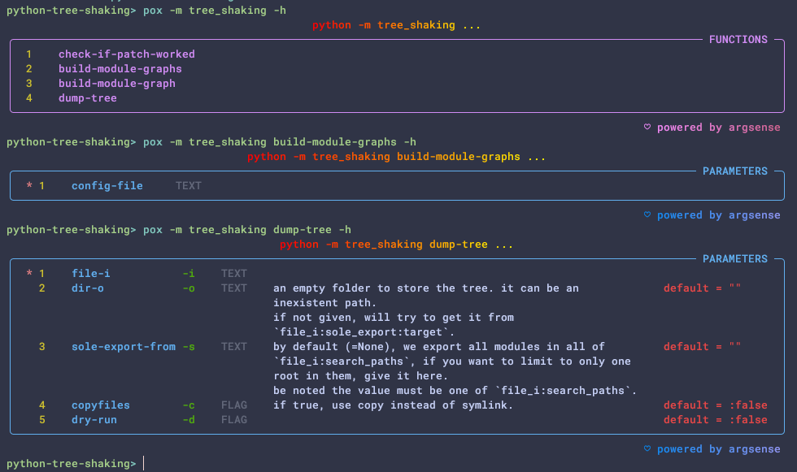

# Python: 基于 "树摇" 的依赖库体积瘦身术

## 工作原理

假设 A 模块依赖于 B 模块. B 模块位于 C 依赖库中. C 是通过 `pip install C` 获得的.

这意味着, 在上述假设情形中, C 目录下除 B 以外的其他文件, 可能是 A 模块不需要的.

这些文件是否可以从 C 中删去, 并且不影响 A 仍然能正常运行?

本项目是对于上述想法的验证.

## 初步结论

就实践结果而言, 本项目发挥的效果远远超出了我的预期. 以 [depsland](https://github.com/likianta/depsland) 项目为例, 原 site-packages 体积为 1.1GB, 经树摇技术裁剪后体积仅为 71MB[^1], 并且经 7z 压缩后仅 17MB, 这对于 Python 应用打包和网络分发来说是非常好的消息. 即使考虑到上述对比中包含了很多不严谨的因素, 树摇技术对体积优化的效果仍然值得深入研究.

## 安装

通过 pip 安装, 注意要求 python 版本在 3.12 及以上.

```sh
pip install tree-shaking
```

## 使用

### 编写配置文件

`tree-shaking` 是通过配置文件来处理依赖的.

配置文件主要提供两个信息:

- 入口脚本在哪里
- 依赖库的搜索目录有哪些

下面从一个示例文件来详细讲解每个配置项:

```yaml
# config_example.yaml
root: .
search_paths:
  - .venv/Lib/site-packages
  - lib
  - src
  - .
entries:
  - src/main.py
  - .venv/Lib/site-packages/IPython/__main__.py
  - .venv/Lib/site-packages/streamlit/__main__.py
ignores:
  - matplotlib
  - numpy
  - pandas
export:
  source: .venv/Lib/site-packages
  target: dist/minideps
```

#### 文件规范

- 文件位置

  配置文件对放置位置没有要求. 推荐的做法是放在项目的根目录, 或者 "build" 目录下.

- 文件名称

  配置文件的名称也没有要求. 一般习惯命名为 "tree_shaking_model.yaml" 或 "mini_deps.yaml".

- 文件后缀

  支持以下类型:

  - .yaml (推荐)
  - .yml
  - .toml
  - .tml
  - .json
  - .pkl (实验性支持)

  本文的示例文件就是 YAML 格式. 如果要用 TOML 或 JSON, 请自行对格式做相应调整.

总的来说, 配置文件的规范是比较宽松的, 可以放在任意位置, 任意命名, 多种后缀类型都支持.

#### `root` 字段

`root` 用于指定项目的根目录. 可以是绝对路径或相对路径, `/` 和 `\\` 路径分隔符均可.

推荐使用相对路径.

相对路径是相对于配置文件自身所在的目录. 例如, 配置文件位于 `<project>/config_example.yaml`, 那么 `root: .` 就指向项目根目录; 如果放在 `<project>/build/config_example.yaml`, 那么 `root: ..` 指向项目根目录.

#### `search_paths` 字段

该字段类似于 python 的 `sys.path` 定义, 但有更多限制:

- 必须使用相对路径, 且相对于 `<root>` 字段.
- 必须是有效的文件夹 (即: 不可以是不存在的路径, 或者 "xxx.zip" 之类的路径).

通常, 我们至少会把 site-packages 所在目录, 以及入口文件的父目录 (比如 ".", "src") 加入到 `search_paths` 字段. 如果你的代码中有用到自定义的 `sys.path.append(...)` 之类的操作, 那么建议把它们也加入到 `search_paths` 字段.

需要注意的是, 有些人使用全局的 site-packages 目录, 或者把虚拟环境放在项目以外的地方了, 这时候用相对路径就会加很多 "../", 而且不同设备上可能路径也不一样, 解决方法是使用软链接将 site-packages 链向项目内, 比如:

```sh
python -m lk_utils mklink <other_path>/site-packages <project>/.deps
```

然后设置 `root_paths: [".deps", "."]`.

这些路径的处理优先级和 python 的 `sys.path` 一样, 越靠前的优先级越高.

#### `entries` 字段

将一个或多个入口脚本添加到这里.

所谓的入口脚本, 就是你的项目是怎么通过 python 调用起来的. 比如你用的是 `python src/hello_world/main.py`, 则将 "src/hello_world/main.py" 添加到该字段. 如果用的是 `python -m hello_world ...`, 则将 "src/hello_world/\_\_main\_\_.py" 添加到该字段.

需要注意, 如果你的项目会用到 `ipython ...`, `python -m IPython ...`, 则 ".venv/Lib/site-packages/IPython/\_\_main\_\_.py" 也要加进去.

比较容易让人忽略的地方是, 如果你没有用 `ipython ...`, 但是你的代码里用到了 `subprocess.run('ipython ...')`, 那也要将 ".venv/Lib/site-packages/IPython/\_\_main\_\_.py" 加到字段里. 否则树摇结果中可能会缺失 IPython 及其相关依赖.

每个路径的格式要求:

- 必须使用相对路径, 且相对于 `<root>` 字段.
- 必须是 ".py" 结尾的文件.
- 脚本所在路径必须能被搜索到, 比如 `entries: ["test/xxx.py", ...]`, 则必须确保 "test" 或者 "." 位于 `search_paths` 中.

#### `ignores` 字段

这是一个可选字段 ("可选字段" 的意思是, 该字段可有可无, 即使将该字段从配置文件中删除, 也不影响 tree-shaking 工作).

该字段用于以下情形: 如果你发现 tree-shaking 裁剪得不到位, 裁剪后仍然包含了某个体积庞大且根本不需要的依赖 (比较典型的案例: 你的代码里某个 if 条件才会导入这个依赖, 但你认为即使删除这个依赖, 也几乎不会影响程序运行).

为了不让 tree-shaking 分析这个依赖和它的下游依赖 (即依赖和依赖的依赖...), 你可以将它加入到 `ignores` 字段.

每个依赖的格式要求:

- 使用全小写名称. 比如 "pandas", "ipython", "pil", "six" 等.
- 不要将 `entries` 中的模块添加到这里. 例如你在 `entries` 中声明了 `entries: ["test/foo.py"]`, 则不要写 `ignores: ["foo"]`.

#### `export` 字段

定义导出路径.

`export` 有两个子键: `export: {"source": ..., "target": ...}`.

- `export.source`

  `export.source` 表示从哪个单一搜索路径来获取原始依赖文件. 通常我们用的是 site-packages 目录.

  如果你的所有依赖都安装在 site-packages 目录, 那么在这里填此路径即可.

  如果你的依赖来源于多个目录, 那么该字段留空 (`source: null` 或者 `source: ""`), 或者删掉该字段也可以.

  为空和不为空会对导出结果的目录结构产生影响, 下面是案例对比:

  - `export.source` 为空的情况:

    ```yaml
    # tree_shaking_model.yaml
    ...
    entries:
      - .venv/Lib/site-packages
      - lib
      - src
      - .
    export:
      source: null
      target: dist/minideps
    ```

    生成结果:

    ```
    <project>
    |= dist
       |= minideps
          |= site-packages
             |= IPython
             |= requests
             |= streamlit
             |= ...
          |= lib
             |= lk_utils
             |= ...
          |= src
             |= ...
    ```

  - 不为空的情况:

    ```yaml
    # tree_shaking_model.yaml
    ...
    entries:
      - .venv/Lib/site-packages
      - lib
      - src
      - .
    export:
      source: .venv/Lib/site-packages
      target: dist/minideps
    ```

    生成结果:

    ```python
    <project>
    |= dist
       |= minideps
          |= IPython
          |= requests
          |= streamlit
          |= ...
    ```

  从实践角度来讲, 推荐使用 "不为空" 的方案.

  例如, 你的所有第三方依赖都来自 venv 中的 "site-packages" 目录, 但也有少量私有依赖 (比如自己编写的 python 包) 放在了 "private_libs" 目录, 那么可以这样做:

  ```yaml
  entries:
    - private_libs
    - .venv/Lib/site-packages
  ...
  export:
    source: .venv/Lib/site-packages
    target: dist/minideps
  ```

  生成结果:

  ```
  <project>
  |= dist
     |= minideps
        |= IPython
        |= requests
        |= streamlit
        |= ...
  ```

  然后, 修改自己的入口脚本的代码:

  ```python
  import sys
  sys.path.append('private_libs')
  sys.path.append('dist/minideps')
  
  ...
  ```

  格式要求 (小结):

  - 该字段为可选字段.
  - 该字段的值可以是 null, 空字符串, 或者一个有效的相对路径, 且相对于 `<root>` 字段.
  - 推荐使用相对路径.
  - 相对路径必须是 `entries` 中的其中一个值.

- `export.target`

  指定要将生成结果放在哪个目录.

  这个目录可以事先不存在. 比如 `target: "dist/minideps"`, 其中 "minideps" 目录可以事先不存在 (但是 "dist" 必须存在), tree-shaking 会自动创建出来.

  如果要导出的目录已经存在, 请确保这个目录是一个空目录. 否则 tree-shaking 会按照 "增量更新" 的方式导出, 关于 "增量更新" 会在下面讲解.

  路径格式要求 (小结):

  - 必须使用相对路径, 且相对于 `<root>` 字段.
  - 可以是一个不存在的目录, 但请确保父目录是存在的.
  - 可以是一个已存在的空目录.
  - 可以是一个已存在的非空目录, 在这种情况下, 请确保非空的内容是来自上次导出的结果, 不要手动放入其他文件. tree-shaking 会对非空目录按照 "增量更新" 处理.

### 分析和导出

tree-shaking 支持命令行和脚本两种用法. 这里分别展示.

#### 命令行用法

```sh
# show help
python -m tree_shaking -h
```



一共有四个命令, 目前只有 `build-module-graphs` 和 `dump-tree` 有用 (其他两个没有更新和维护, 未来可能重构或删除).

- `build-module-graphs`

  如果是第一次对自己的项目使用树摇, 或者项目的依赖有更新过, 则调用 `build-module-graphs` 命令:

  ```sh
  python -m tree_shaking build-module-graphs <config_file>
  
  # 示例
  python -m tree_shaking build-module-graphs build/tree_shaking_model.yaml
  ```

  `<config_file>` 就是刚才我们编写的配置文件的路径. 这里传绝对路径或相对路径都是可以的.

  tree-shaking 会解析配置文件中定义的 `entries`, 并将解析结果保存在 `<tree_shaking>/_cache/module_graphs/<entry_id>.yaml`.

  注意: 如果已经调用过一次 `build-module-graphs`, 并且后续没有更新过项目的依赖, 那么就没必要再调用该命令了.

- `dump-tree`

  将结果导出到目标目录.

  ```sh
  python -m tree_shaking dump-tree <config_file> [target_folder]
  
  # 示例
  python -m tree_shaking dump-tree build/tree_shaking_model.yaml dist/minideps
  ```

  这里的 `target_folder` 是可选值. 如果指定了一个路径, 则会覆盖 `config.export.target` 配置. 否则使用配置文件中的值.

  此外, `dump-tree` 有一个 "dry-run" 参数, 可以用 `--dry-run` 或者 `-d` 传入. 它不会导出真实的结果, 但会把模拟过程打印出来.

  所谓的模拟过程, 就是描述了 tree-shaking 是怎么从 `entries` 中有选择地选取文件, 拷贝到目标目录下的哪个子路径.

#### 脚本用法

编写一个脚本文件, 例如 `build/build_project.py`:

```python
import os
import tree_shaking
os.chdir(f'{__file__}/../')
tree_shaking.build_module_graphs('./tree_shaking_module.yaml')
tree_shaking.dump_tree('./tree_shaking_module.yaml', '../dist/minideps')
#   第二个参数是可选值, 如果不指定, 则使用 `config.export.target` 配置.
```

## 增量更新

增量更新不需要更换命令, 重复上面的使用流程, 然后只要导出的目录不变且非空, tree-shaking 就会采用增量更新策略.

这里讲一下增量更新是怎么做到的.

...

## 修复缺失的文件

...

[^1]: 需要注意的是, 该体积对比是非常不严谨的. 原 site-packages 的体积是通过 `poetry install` 包含了 dev-dependencies 的内容 (特别是 pyside6 库占了很大的比重); 后者则去除了 dev-dependencies.


